# Annette

A TypeScript library for crafting interaction nets, with abstractions for reactive programming, state management, distributed systems, and more.

[](https://www.npmjs.com/package/annette)

📖 [API Documentation](./api-documentation.md) | 📚 [Examples](./examples/) | 📦 [npm package](https://www.npmjs.com/package/annette)

## What is Annette?

Annette is a TypeScript library that models applications as networks of interacting agents. Instead of traditional object-oriented or functional approaches, it uses a graph-based model where:

- **Agents** are like tiny programs with specific roles
- **Ports** are connection points on agents
- **Rules** define what happens when agents connect
- **Networks** manage the connections and execution

This approach can help with:
- Understanding data flow in complex applications
- Building reactive user interfaces
- Managing state across distributed systems
- Debugging with time travel capabilities

## How Annette Works - Visual Overview

```mermaid
graph LR
    %% Define styles for different element types
    classDef agent fill:#4a90e2,stroke:#2c5aa0,stroke-width:2px,color:#ffffff
    classDef rule fill:#50c878,stroke:#2e7d32,stroke-width:2px,color:#ffffff
    classDef port fill:#ff6b6b,stroke:#d63031,stroke-width:2px,color:#ffffff
    classDef value fill:#ffd93d,stroke:#e17055,stroke-width:2px,color:#2d3436
    classDef connection fill:#a29bfe,stroke:#6c5ce7,stroke-width:2px,color:#ffffff
    classDef network fill:#636e72,stroke:#2d3436,stroke-width:2px,color:#ffffff

    subgraph "Step 1: Agents Created"
        direction LR
        Counter1["🎯<br/>Counter Agent<br/>💾 Value: 0"]:::agent
        CounterPort1(("📡<br/>main")):::port
        Incrementer1["⚡<br/>Incrementer Agent<br/>💾 Value: 1"]:::agent
        IncrementerPort1(("📡<br/>main")):::port
        Rule1{{"🔄<br/>Increment Rule<br/>counter.value += incrementer.value"}}:::rule

        Counter1 --> CounterPort1
        Incrementer1 --> IncrementerPort1
    end

    subgraph "Step 2: Ports Connect"
        direction LR
        Counter2["🎯<br/>Counter Agent<br/>💾 Value: 0"]:::agent
        CounterPort2(("📡<br/>main")):::port
        Connection2>"🔗<br/>Connection<br/>Object"]:::connection
        Incrementer2["⚡<br/>Incrementer Agent<br/>💾 Value: 1"]:::agent
        IncrementerPort2(("📡<br/>main")):::port
        Rule2{{"🔄<br/>Increment Rule<br/>counter.value += incrementer.value"}}:::rule

        Counter2 --> CounterPort2
        Incrementer2 --> IncrementerPort2
        CounterPort2 -->|"🔗 Connect"| Connection2
        IncrementerPort2 -->|"🔗 Connect"| Connection2
    end

    subgraph "Step 3: Rule Executes"
        direction LR
        Counter3["🎯<br/>Counter Agent<br/>💾 Value: 1"]:::agent
        CounterPort3(("📡<br/>main")):::port
        Connection3>"🔗<br/>Connection<br/>Object"]:::connection
        Incrementer3["⚡<br/>Incrementer Agent<br/>💾 Value: 1"]:::agent
        IncrementerPort3(("📡<br/>main")):::port
        Rule3{{"✅<br/>Increment Rule<br/>Executed!"}}:::rule

        Counter3 --> CounterPort3
        Incrementer3 --> IncrementerPort3
        CounterPort3 -->|"🔗 Connected"| Connection3
        IncrementerPort3 -->|"🔗 Connected"| Connection3
        Connection3 -->|"🎯 Triggers"| Rule3
        Rule3 -->|"📤 Updates"| Counter3
    end

    %% Key concepts with distinct shapes
    subgraph "Key Concepts"
        direction LR
        AgentDef[/"🧩<br/>Agent<br/>Named entity with<br/>value & ports"/]:::agent
        PortDef((("📡<br/>Port<br/>Connection point<br/>(main/aux)"))):::port
        ConnectionDef["🔗<br/>Connection<br/>Links between ports"]:::connection
        RuleDef["🔄<br/>Rule<br/>Logic for<br/>interactions"]:::rule
        NetworkDef["🌐<br/>Network<br/>Container managing<br/>everything"]:::network
    end
```



```mermaid
sequenceDiagram
    participant N as 🌐 Network
    participant C as 🎯 Counter Agent
    participant CP as 📡 Counter Port
    participant IP as 📡 Incrementer Port
    participant Conn as 🔗 Connection
    participant R as 🔄 Increment Rule

    box rgb(230, 245, 254) Agent Creation
    N->>C: Create Agent("Counter", 0)
    N->>CP: Create main port
    N->>R: Create ActionRule(...)
    end

    box rgb(245, 229, 245) Port Connection
    CP->>Conn: 🔗 Connect to Incrementer port
    IP->>Conn: 🔗 Connection established
    Conn->>N: Connection registered
    end

    box rgb(232, 245, 232) Rule Execution
    N->>Conn: Find matching rule
    Conn->>R: 🎯 Trigger rule execution
    R->>C: counter.value += incrementer.value
    C->>R: Return updated agent
    R->>N: Interaction complete
    end

    Note over C: 💾 Value changed: 0 → 1
```

**🎯 Accurate Interaction Flow:**

**📊 How It Really Works:**
1. **🌐 Network** contains agents, ports, and rules
2. **📡 Ports** connect to each other (not directly to rules)
3. **🔗 Connection Object** is created when ports connect
4. **🔄 Rule** is triggered by the connection (not connected to ports directly)
5. **🎯 Rule executes** and updates agent values
6. **📤 Updates** flow back through the connection to agents

**🎨 Visual Guide:**

**📊 Graph View (Top):**
- **🎯 Blue Rounded Rectangles**: Agents - the main actors
- **📡 Red Circles**: Ports - connection points on agents
- **🔗 Purple Rounded Squares**: Connection objects - links between ports
- **🔄 Green Diamonds**: Rules - logic that executes on connections
- **💾 Yellow Rounded Squares**: Values - data that changes
- **🌐 Gray Box**: Network container - manages everything

**⏱️ Sequence View (Bottom):**
- **🎨 Colored Boxes**: Group related phases
- **🔗 Connection Icons**: Show port-to-port connections
- **🎯 Trigger Icons**: Show rule activation
- **💾 Data Icons**: Highlight value changes

**✨ Key Architectural Insight:**
- **Ports connect to ports**, not ports to rules
- **Connections are first-class objects** that trigger rules
- **Rules are separate** from the connection structure
- **Network orchestrates** the entire interaction

## Installation

```bash
npm install annette
```

## Table of Contents

- [Quick Start](#quick-start)
- [Core Concepts](#core-concepts)
  - [Agents](#agents)
  - [Ports](#ports)
  - [Networks](#networks)
  - [Rules](#rules)
  - [Connections](#connections)
- [Building Intuition](#building-intuition)
  - [Simple Counter](#simple-counter)
  - [State Machine](#state-machine)
  - [Data Flow](#data-flow)
- [Advanced Features](#advanced-features)
  - [Time Travel](#time-travel)
  - [Reactivity](#reactivity)
  - [Distributed Systems](#distributed-systems)
  - [Serialization](#serialization)
- [API Reference](#api-reference)
  - [Core Engine](#core-engine)
  - [Standard Library](#standard-library)
  - [Application Layer](#application-layer)
- [Examples](#examples)
- [When to Use Annette](#when-to-use-annette)
- [Tutorials](#tutorials)

## Quick Start

Let's start with something simple - a counter that increments when clicked:

```typescript
import { Agent, Network, ActionRule } from 'annette';

// 1. Create a network (like a container for your agents)
const net = Network("counter-app");

// 2. Create agents (like tiny programs with specific roles)
const counter = Agent("Counter", 0);
const incrementer = Agent("Incrementer", 1);

// 3. Add agents to the network
net.addAgent(counter);
net.addAgent(incrementer);

// 4. Define what happens when agents connect
const incrementRule = ActionRule(
  counter.ports.main,
  incrementer.ports.main,
  (counter, incrementer) => {
    // This runs when the agents connect
    counter.value += incrementer.value;
    return [counter, incrementer]; // Return agents to keep them in the network
  }
);

// 5. Add the rule to the network
net.addRule(incrementRule);

// 6. Connect the agents
net.connectPorts(counter.ports.main, incrementer.ports.main);

// 7. Execute the interaction
console.log("Before:", counter.value); // 0
net.step(); // Execute one interaction
console.log("After:", counter.value);  // 1
```

That's it! You've just created your first Annette application. The counter and incrementer are agents that interact through a rule when connected.

## Core Concepts

### Agents

**Think of agents as tiny programs with a specific role.** Each agent has:

- A **name** (like "Counter", "User", "Database") that defines its type
- A **value** that can be any TypeScript type
- **Named ports** for connecting to other agents

```typescript
// Basic agent with a number value
const counter = Agent<"Counter", number>("Counter", 0);

// Agent with complex data
const user = Agent<"User", { name: string; age: number }>("User", {
  name: "Alice",
  age: 30
});

// Agent with custom ports
const processor = Agent("Processor", { status: "idle" }, {
  input: Port("input", "main"),
  output: Port("output", "aux"),
  control: Port("control", "aux")
});
```

**Key Insight**: Agents are like actors in a play - they have a role (name), state (value), and ways to communicate (ports).

### Ports

**Ports are connection points on agents.** They're like electrical sockets - you can plug things into them.

```typescript
// Create different types of ports
const mainPort = Port("main", "main");    // Main interaction point
const auxPort = Port("output", "aux");    // Auxiliary connection point
```

Each port has:
- A **name** (like "main", "input", "output")
- A **type** ("main" or "aux")

**Key Insight**: Main ports are for primary interactions, aux ports are for secondary connections (like passing results to other agents).

### Networks

**Networks are containers that hold agents and manage their interactions.**

```typescript
// Create a network
const net = Network("my-app");

// Add agents
net.addAgent(counter);
net.addAgent(incrementer);

// Connect agents
net.connectPorts(counter.ports.main, incrementer.ports.main);

// Execute interactions
net.step();    // One interaction
net.reduce();  // All possible interactions
```

**Key Insight**: The network is like a circuit board - it provides the structure for agents to interact.

### Rules

**Rules define what happens when agents connect.** There are two types:

#### ActionRule (Imperative)

For custom logic when agents interact:

```typescript
const incrementRule = ActionRule(
  counter.ports.main,
  incrementer.ports.main,
  (counter, incrementer) => {
    // Your custom logic here
    counter.value += incrementer.value;
    return [counter, incrementer]; // Return agents to keep them
  }
);
```

#### RewriteRule (Declarative)

For transforming the network structure:

```typescript
const addRule = RewriteRule(
  number1.ports.main,
  number2.ports.main,
  (n1, n2) => ({
    newAgents: [
      {
        name: "Result",
        initialValue: n1.value + n2.value,
        _templateId: "sum"
      }
    ],
    internalConnections: [],
    portMapAgent1: { result: { newAgentTemplateId: "sum", newPortName: "main" } },
    portMapAgent2: { result: null }
  })
);
```

**Key Insight**: ActionRules are for "what to do", RewriteRules are for "how to transform the graph".

### Connections

**Connections link ports between agents:**

```typescript
// Connect two ports
net.connectPorts(agent1.ports.main, agent2.ports.input);

// Or create a connection object first
const conn = Connection(agent1.ports.output, agent2.ports.input);
net.addConnection(conn);
```

**Key Insight**: Connections are like wires in a circuit - they define the flow of information.

## Building Intuition

Let's build your understanding step by step with practical examples.

### Simple Counter

Let's create a counter that can be incremented and decremented:

```typescript
import { Agent, Network, ActionRule } from 'annette';

const net = Network("counter-example");

// Create our agents
const counter = Agent<"Counter", number>("Counter", 0);
const incrementer = Agent<"Incrementer", number>("Incrementer", 1);
const decrementer = Agent<"Decrementer", number>("Decrementer", -1);

// Add them to the network
net.addAgent(counter);
net.addAgent(incrementer);
net.addAgent(decrementer);

// Create rules for incrementing and decrementing
const incrementRule = ActionRule(
  counter.ports.main,
  incrementer.ports.main,
  (counter, incrementer) => {
    counter.value += incrementer.value;
    return [counter, incrementer];
  }
);

const decrementRule = ActionRule(
  counter.ports.main,
  decrementer.ports.main,
  (counter, decrementer) => {
    counter.value += decrementer.value; // Adding a negative number
    return [counter, decrementer];
  }
);

// Add rules to network
net.addRule(incrementRule);
net.addRule(decrementRule);

// Test incrementing
console.log("Initial:", counter.value); // 0
net.connectPorts(counter.ports.main, incrementer.ports.main);
net.step();
console.log("After increment:", counter.value); // 1

// Test decrementing
net.connectPorts(counter.ports.main, decrementer.ports.main);
net.step();
console.log("After decrement:", counter.value); // 0
```

**What you learned:**
- Multiple agents can interact with the same counter
- Each rule defines a specific interaction pattern
- Agents maintain their state between interactions

### State Machine

Let's build a simple state machine:

```typescript
import { Agent, Network, ActionRule } from 'annette';

const net = Network('state-machine');

// Create state and event agents
const state = Agent<'State', string>('State', 'idle');
const startEvent = Agent<'Event', string>('Event', 'start');
const stopEvent = Agent<'Event', string>('Event', 'stop');

// Add to network
net.addAgent(state);
net.addAgent(startEvent);
net.addAgent(stopEvent);

// Create transition rules
const startRule = ActionRule(
  state.ports.main,
  startEvent.ports.main,
  (state, event) => {
    if (state.value === 'idle' && event.value === 'start') {
      state.value = 'running';
    }
    return [state, event];
  }
);

const stopRule = ActionRule(
  state.ports.main,
  stopEvent.ports.main,
  (state, event) => {
    if (state.value === 'running' && event.value === 'stop') {
      state.value = 'idle';
    }
    return [state, event];
  }
);

net.addRule(startRule);
net.addRule(stopRule);

// Test the state machine
console.log("Initial state:", state.value); // 'idle'

net.connectPorts(state.ports.main, startEvent.ports.main);
net.step();
console.log("After start:", state.value); // 'running'

net.connectPorts(state.ports.main, stopEvent.ports.main);
net.step();
console.log("After stop:", state.value); // 'idle'
```

**What you learned:**
- Agents can represent both data (state) and actions (events)
- Rules can have conditions (if statements)
- The same agents can be reused for different interactions

### Data Flow

Let's create a data processing pipeline:

```typescript
import { Agent, Network, ActionRule, Port } from 'annette';

const net = Network("data-pipeline");

// Create data processing agents
const input = Agent("Input", { data: [1, 2, 3, 4, 5] }, {
  main: Port("main", "main"),
  output: Port("output", "aux")
});

const filter = Agent("Filter", { condition: (x: number) => x > 3 }, {
  input: Port("input", "main"),
  output: Port("output", "aux")
});

const output = Agent("Output", { results: [] }, {
  input: Port("input", "main")
});

// Add to network
net.addAgent(input);
net.addAgent(filter);
net.addAgent(output);

// Create processing rules
const inputToFilterRule = ActionRule(
  input.ports.main,
  filter.ports.input,
  (input, filter) => {
    // Process data and pass results to output port
    const filtered = input.value.data.filter(filter.value.condition);
    input.value.processed = filtered;
    return [input, filter];
  }
);

const filterToOutputRule = ActionRule(
  filter.ports.output,
  output.ports.input,
  (filter, output) => {
    // This would receive the processed data
    // In a real scenario, you'd pass data through aux ports
    return [filter, output];
  }
);

net.addRule(inputToFilterRule);
net.addRule(filterToOutputRule);

// Connect the pipeline
net.connectPorts(input.ports.main, filter.ports.input);
net.connectPorts(filter.ports.output, output.ports.input);

// Process the data
net.step();
console.log("Filtered data:", input.value.processed); // [4, 5]
```

**What you learned:**
- Agents can have multiple ports for different types of connections
- Data can flow through a pipeline of transformations
- Aux ports can be used for passing results to other agents

## Design Philosophy

Annette is based on [interaction nets](https://en.wikipedia.org/wiki/Interaction_nets), a theoretical model of computation that naturally embodies several powerful properties:

### Natural Causality Preservation

**The graph structure inherently maintains cause-and-effect relationships.** When agents interact, the connections between them explicitly represent data dependencies:

```typescript
// Each interaction preserves causality through explicit connections
const incrementRule = ActionRule(
  counter.ports.main,
  incrementer.ports.main,
  (counter, incrementer) => {
    // The counter's new state is directly caused by the incrementer
    counter.value += incrementer.value;
    return [counter, incrementer];
  }
);
```

**Why this matters:** Unlike traditional approaches where causality can be implicit and hard to trace, Annette makes data flow explicit through the network structure. This makes debugging, testing, and reasoning about your application much easier.

### Built-in Scope Isolation

**Each agent maintains its own scope and state boundaries.** Agents can only communicate through explicit port connections, preventing unintended side effects:

```typescript
// Agents maintain clean boundaries
const user = Agent("User", { name: "Alice", preferences: { theme: "dark" } });
const settings = Agent("Settings", { theme: "light" });

// They can only interact through explicit rules
const updateThemeRule = ActionRule(
  user.ports.main,
  settings.ports.main,
  (user, settings) => {
    // Controlled interaction - no accidental state leakage
    user.value.preferences.theme = settings.value.theme;
    return [user, settings];
  }
);
```

**Why this matters:** This prevents the "spooky action at a distance" problem common in traditional state management, where changing one piece of state unexpectedly affects others.

### Perfect for Distributed Systems

**The agent-based model naturally supports distribution** because agents are self-contained units that communicate through well-defined interfaces:

```typescript
// Agents can be distributed across different processes/machines
const clientDoc = Agent("Document", { content: "Hello" });
const serverDoc = Agent("Document", { content: "" });

// Synchronization happens through explicit operations
const syncRule = ActionRule(
  clientDoc.ports.sync,
  serverDoc.ports.sync,
  (client, server) => {
    // Merge changes through defined conflict resolution
    server.value.content = resolveConflicts(client.value.content, server.value.content);
    return [client, server];
  }
);
```

**Why this matters:** Traditional approaches often retrofit distribution onto centralized models, leading to complex synchronization issues. Annette's model is inherently distributed-friendly.

### Promotes Safe Concurrency

**The interaction model naturally supports concurrent execution** because rules only affect the agents they explicitly reference:

```typescript
// Multiple independent interactions can run concurrently
const rule1 = ActionRule(counter1.ports.main, incrementer1.ports.main, /*...*/);
const rule2 = ActionRule(counter2.ports.main, incrementer2.ports.main, /*...*/);

// These can run in parallel since they don't interfere with each other
network.step(); // May execute both rules concurrently if possible
```

**Why this matters:** Unlike traditional approaches where shared mutable state requires complex locking mechanisms, Annette's model makes it easier to reason about and implement concurrent operations safely.

### These Properties Are Built-In

**Unlike traditional libraries where these properties are add-ons or afterthoughts, they're fundamental to Annette's design:**

- **No additional libraries needed** for causality tracking or time travel
- **No complex setup** for distributed synchronization
- **No external tools** required for debugging data flow
- **No special configuration** for concurrent execution

The interaction nets foundation means these capabilities are naturally present in the model, not bolted on as features.

## Advanced Features

### Time Travel

Annette can track all changes and let you go back in time:

```typescript
import { TimeTravelNetwork, Agent, ActionRule } from 'annette';

const net = TimeTravelNetwork("time-travel-counter");

const counter = Agent("Counter", { count: 0 });
const incrementer = Agent("Incrementer", { by: 1 });

net.addAgent(counter);
net.addAgent(incrementer);

net.addRule(ActionRule(
  counter.ports.main,
  incrementer.ports.main,
  (counter, incrementer) => {
    counter.value.count += incrementer.value.by;
    return [counter, incrementer];
  }
));

// Take a snapshot
const snapshot1 = net.takeSnapshot("Initial state");

console.log("Initial:", counter.value.count); // 0

// Make some changes
net.connectPorts(counter.ports.main, incrementer.ports.main);
net.step();
console.log("After increment 1:", counter.value.count); // 1

net.step();
console.log("After increment 2:", counter.value.count); // 2

const snapshot2 = net.takeSnapshot("After two increments");

// Go back in time
net.rollbackTo(snapshot1.id);
console.log("After rollback:", counter.value.count); // 0
```

### Reactivity

Annette has built-in reactive programming:

```typescript
import { createReactive, createComputed, createEffect } from 'annette';

// Create reactive values
const count = createReactive(0);
const multiplier = createReactive(2);

// Create computed values (automatically update when dependencies change)
const doubled = createComputed(() => count() * multiplier());

// Create effects (run when dependencies change)
createEffect(() => {
  console.log(`Count: ${count()}, Doubled: ${doubled()}`);
});

// Update values - effects run automatically
count(1);        // Logs: "Count: 1, Doubled: 2"
multiplier(3);   // Logs: "Count: 1, Doubled: 3"
count(2);        // Logs: "Count: 2, Doubled: 6"
```

### Distributed Systems

Share state across multiple clients/servers:

```typescript
import { SyncNetwork, Agent, registerSyncRules } from 'annette';

// Create a sync network
const clientNet = SyncNetwork("client-app", "client-1");
const serverNet = SyncNetwork("server-app", "server-1");

// Register sync rules
registerSyncRules(clientNet);
registerSyncRules(serverNet);

// Create shared document
const clientDoc = Agent("Document", {
  id: "doc-123",
  content: "Hello from client",
  version: 1
});

// Add to client network
clientNet.addAgent(clientDoc);

// In real usage, operations would be sent over network
// This is simplified for the example
const operations = clientNet.collectOperations(0);
serverNet.applyOperations(operations);
```

### Serialization

Convert Annette structures to/from strings for storage or network transfer:

```typescript
import { serializeValue, deserializeValue } from 'annette';

// Complex object with circular references
const user = {
  name: "Alice",
  profile: { theme: "dark" }
};
user.self = user; // Circular reference

// Serialize (handles circular references automatically)
const serialized = serializeValue(user);

// Deserialize
const deserialized = deserializeValue(serialized);
console.log(deserialized.self === deserialized); // true
```

## API Reference

### Core Engine

The core engine provides the fundamental interaction net primitives:

```typescript
import { Core } from 'annette';

// Create agents
const counter = Core.createAgent('Counter', 0);
const incrementer = Core.createAgent('Incrementer', 1);

// Create ports
const mainPort = Core.createPort('main', 'main');
const auxPort = Core.createPort('output', 'aux');

// Create connections
const connection = Core.createConnection(counter.ports.main, incrementer.ports.main);

// Create rules
const incrementRule = Core.createActionRule(
  counter.ports.main,
  incrementer.ports.main,
  (counter, incrementer) => {
    counter.value += incrementer.value;
    return [counter, incrementer];
  }
);

// Create networks
const network = Core.createNetwork('my-app');
```

### Standard Library

The standard library provides higher-level utilities and patterns:

```typescript
import { StdLib } from 'annette';

// Time travel networks
const timeTravelNet = StdLib.createEnhancedNetwork('time-travel-app');

// Reactive programming
const count = StdLib.Reactive.createReactive(0);
const doubled = StdLib.Reactive.createComputed(() => count() * 2);

// Specialized data structures
const sharedMap = StdLib.DataStructures.createSharedMap();
const sharedCounter = StdLib.DataStructures.createSharedCounter();

// Effects and handlers
const fetchEffect = StdLib.Effect.EffectAgent({
  type: 'fetch',
  url: 'https://api.example.com/data'
});
```

### Application Layer

The application layer provides high-level APIs for common use cases:

```typescript
import {
  Agent, Network, ActionRule, // Core
  TimeTravelNetwork,           // Time travel
  createReactive,              // Reactive programming
  serializeValue,              // Serialization
} from 'annette';

// All exports are available at the top level for convenience
```

### Key Classes and Functions

#### Core Classes

- **`Agent(name, value, ports?, type?)`**: Creates an agent
- **`Network(name, agents?)`**: Creates a network
- **`ActionRule(port1, port2, action, name?)`**: Creates an action rule
- **`RewriteRule(port1, port2, rewrite, name?)`**: Creates a rewrite rule
- **`Connection(port1, port2, name?)`**: Creates a connection

#### Standard Library Classes

- **`TimeTravelNetwork(name, agents?)`**: Network with time travel
- **`createReactive(initialValue)`**: Creates a reactive value
- **`createComputed(computation)`**: Creates a computed value
- **`createEffect(effect)`**: Creates a side effect

#### Utility Functions

- **`serializeValue(value, options?)`**: Serialize with circular reference support
- **`deserializeValue(serialized, options?)`**: Deserialize values
- **`createPluginNetwork(plugins, name)`**: Create a plugin-enabled network

### Type Definitions

The library provides comprehensive TypeScript types:

```typescript
// Agent types
interface IAgent<Name extends string = string, Value = any, Type extends string = string> {
  name: Name;
  value: Value;
  ports: BoundPortsMap<IAgent<Name, Value, Type>>;
  type: Type;
  _agentId: AgentId;
}

// Network types
interface INetwork<Name extends string = string, A extends IAgent = IAgent> {
  name: Name;
  addAgent(agent: A): A;
  removeAgent(agent: A | string): boolean;
  getAgent(id: string): A | undefined;
  getAllAgents(): A[];
  connectPorts(port1: IBoundPort, port2: IBoundPort): IConnection;
  addRule(rule: AnyRule): void;
  removeRule(rule: AnyRule | string): boolean;
  step(): Promise<boolean>;
  reduce(maxSteps?: number): Promise<number>;
}
```

## Examples

Check out the [examples directory](./examples/) for more comprehensive examples:

- [Simple Counter](./examples/simple.ts) - Basic counter implementation
- [State Machine](./examples/state-machine.ts) - Finite state machine
- [Time Travel](./examples/time-travel.ts) - Undo/redo functionality
- [Distributed Sync](./examples/distributed-sync.ts) - Multi-client synchronization
- [Reactive Todo App](./examples/reactive-todo.ts) - Full reactive application

## Tutorials

Learn Annette step by step with our comprehensive tutorials:

- [Getting Started Tutorial](./docs/getting-started-tutorial.md) - Learn the core concepts with hands-on examples
- [Time Travel Tutorial](./docs/time-travel-tutorial.md) - Master undo/redo and debugging with time travel
- [Reactive Programming Tutorial](./docs/reactive-tutorial.md) - Build reactive user interfaces and applications

## When to Use Annette

Annette can be helpful for:

1. **Complex State Management** - Applications with interconnected state
2. **Real-time Collaboration** - Multi-user applications needing conflict resolution
3. **Offline-First Apps** - Applications that must work offline and sync later
4. **State Machines** - Applications with complex state transitions
5. **Time Travel Debugging** - Applications where debugging state changes is critical
6. **Cross-Context Communication** - Applications sharing state between workers/iframes
7. **TypeScript Projects** - Teams valuing strong typing and compile-time safety

### Feature Comparison

| Feature | Annette | Redux | MobX | XState | Recoil |
|---------|---------|-------|------|--------|--------|
| State Management | ✅ | ✅ | ✅ | ✅ | ✅ |
| Immutable Updates | ✅ | ✅ | ❌ | ✅ | ✅ |
| Mutable API | ✅ | ❌ | ✅ | ❌ | ❌ |
| Time Travel | ✅ | ✅* | ❌ | ✅* | ❌ |
| Reactivity | ✅ | ❌ | ✅ | ❌ | ✅ |
| Fine-grained Updates | ✅ | ❌ | ✅ | ❌ | ✅ |
| State Machines | ✅ | ❌ | ❌ | ✅ | ❌ |
| Distributed Sync | ✅ | ❌ | ❌ | ❌ | ❌ |
| Algebraic Effects | ✅ | ❌ | ❌ | ❌ | ❌ |
| Type Safety | ✅ | ✅* | ✅ | ✅ | ✅ |
| Serialization | ✅ | ✅* | ❌ | ✅* | ❌ |

*With additional libraries or configuration

## Getting Started

```bash
npm install annette
```

Then import what you need:

```typescript
import {
  Agent,
  Network,
  ActionRule,
  createReactive,
  TimeTravelNetwork
} from 'annette';
```

You can also import from specific layers based on your needs:

```typescript
// Core layer only
import { Core } from 'annette';
const network = Core.createNetwork('minimal');

// Standard library
import { StdLib } from 'annette';
const enhancedNetwork = StdLib.createEnhancedNetwork('full-featured');

// Specific features
import {
  Agent, Network, ActionRule,  // Core
  TimeTravelNetwork,           // Standard Library
  serializeValue,              // Application Layer
} from 'annette';
```

## Contributing

We welcome contributions! See our [contributing guide](CONTRIBUTING.md) for details.

## License

MIT License - see [LICENSE](LICENSE) for details.

---

**Ready to build something amazing?** Annette provides the foundation for creating robust, scalable applications with clear data flow and powerful abstractions. Start with the [Quick Start](#quick-start) guide and explore the [examples](./examples/) to see what's possible! 🚀